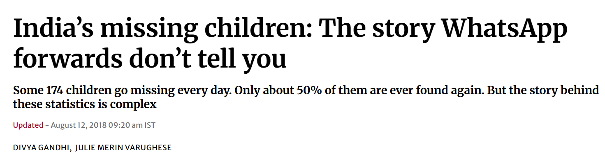
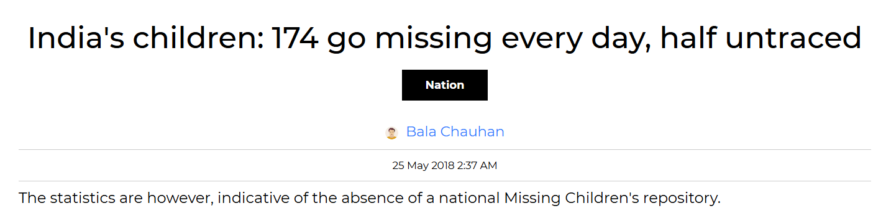
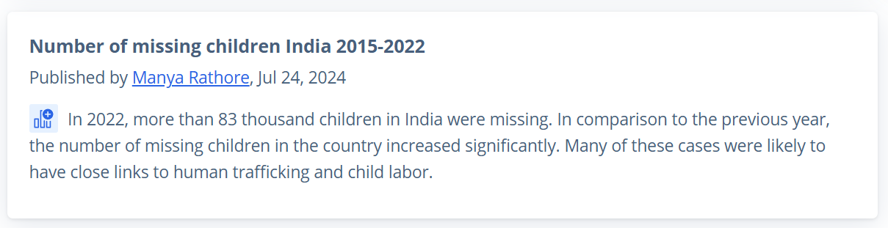
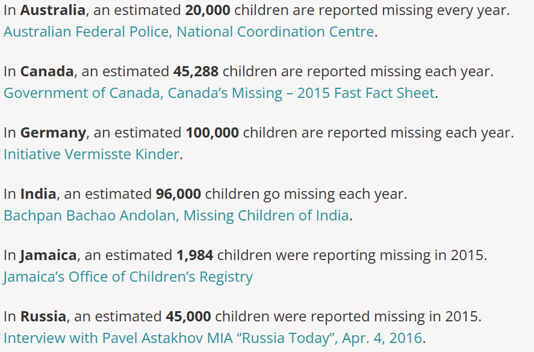

# Find Missing Person using AI
 


### Endorse me at LinkedIn if this project was helpful. [ LinkedIn](https://www.linkedin.com/in/gaganmanku96/)


Hundreds of people (especially children go missing every day) in India. There are various <b>NGO's and Govt Initiatives</b> to help with it. This project tries to implement an  existing/new way to help.

### News Articles






### Screenshots

<table>
  <tr>
    <td></td>
    <td></td>
    <td></td>
  </tr>
  <tr>
    <td></td>
    <td></td>
    <td></td>
  </tr>
</table>


## What is the objective of this Project and how will it help?
The objective of this project is to help Police and higher authorities to track down missing people quickly. The usual process to track a person is using investigation which requires time and experience (to ask right questions). Most of the time, investigation method works pretty well but it is time consuming and can be unsuccessful if the person (missing) has been shifted/moved to different location (city/country).<br>
In such cases, the ideal approach is to go through CCTV footages and evidences. Again, this can be very time consuming and given the number of people that go missing everyday, it can be a challanage to keep up with it.<br>

### Project Overview

Thousands of people, especially children, go missing every day in India. Despite efforts from NGOs and government initiatives, timely recovery remains a challenge. Traditional investigative methods, while effective, can be slow and resource-intensive. This project introduces an **AI-assisted platform** designed to expedite the process of locating missing individuals by:

- Leveraging advanced facial recognition using **MediaPipe Face Mesh**.
- Enabling rapid scanning of large volumes of images (e.g., CCTV, public submissions).
- Providing accessible web and mobile interfaces for authorities and the public.


### Key Features

- **Seamless Registration**  
  Easily register new missing person cases, including image uploads with automated facial feature extraction.
- **Efficient Matching**  
  Match submitted images against the database using face mesh data, reducing manual review burden.
- **Multi-User Dashboards**  
  Admin and user interfaces for managing, updating, and monitoring cases.
- **Public Engagement**  
  Mobile and web submission portals for sighting reports.
- **Lightweight & Portable**  
  All data is stored in SQLite; ready-to-run with minimal setup.

## How to Run

1. Clone the repository and install dependencies:
   ```bash
   git clone https://github.com/gaganmanku96/Finding-missing-person-using-AI.git
   cd Finding-missing-person-using-AI
   pip install -r requirements.txt
   ```
2. Run the main web app:
   ```bash
   streamlit run Home.py
   ```
3. To use the mobile/public submission app:
   ```bash
   streamlit run mobile_app.py
   ```

- The database will auto-create on first run (SQLite, file: `sqlite_database.db`).
- Images are stored in the `resources/` folder.

### Use Cases

- Law enforcement agencies reviewing large volumes of CCTV footage.
- NGOs and government bodies searching for missing children/persons.
- Crowdsourced submissions from the general public via mobile or web.


### Vote of Thanks
- Thanks to the [MediaPipe](https://mediapipe.dev/) team for their open-source face mesh solution, now powering this project!
